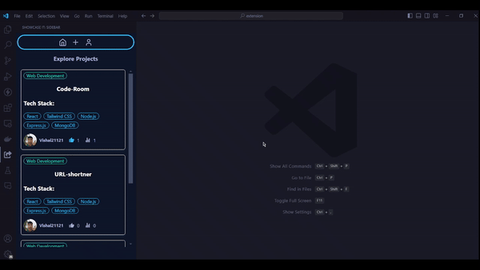

# ShowCase It

**ShowCase It** is a powerful Visual Studio Code extension designed to help developers effortlessly share their projects and explore the work of others. With seamless GitHub integration, real-time updates, and support for Markdown, ShowCase It makes it easy to showcase your tech stack, get feedback, and discover innovative projects from the community. Whether you're looking to share your latest creation or find inspiration, ShowCase It is the perfect tool to enhance your development experience.

## Features

- **Project Sharing:** Share your projects with the community effortlessly.
- **Explore Projects:** Discover and explore projects shared by others.
- **GitHub Integration:** Seamless integration with GitHub for authentication.
- **Real-time Updates:** Get real-time updates on project likes and views.
- **Tech Stack Display:** Showcase the tech stack used in your projects.
- **Markdown Support:** Write and render project descriptions using Markdown.

## Installation

1. Open VS Code.
2. Go to the Extensions view by clicking on the Extensions icon in the Activity Bar on the side of the window or by pressing `Ctrl+Shift+X`.
3. Search for "ShowCase It".
4. Click Install.

## Usage

1. **Login with GitHub:**

   - Click on the "ShowCase It" icon in the Activity Bar.
   - Click on the "Login with GitHub" button to authenticate.

2. **Create a Project:**

   - Click on the "Create Project" button.
   - Fill in the project details and click "Submit".

3. **Explore Projects:**
   - Browse through the list of projects shared by others.
   - Click on a project to view its details.
